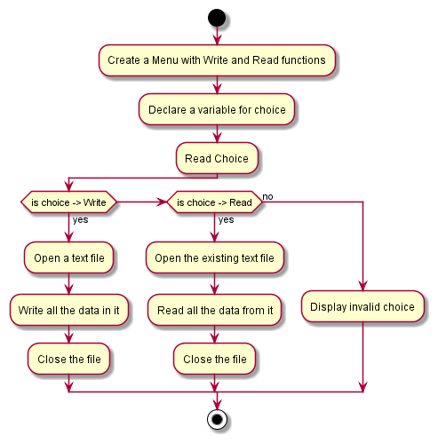

# File-Struct

# Banking-System
- Objective:

    To create a menu which performs tasks such as writing and reading from file struct and struct to file.

The repository consists of following directories:

- Assets:

    Assets are flowchart files. We created our flowchart for the task using Plantuml and stored it here.

- Src:

    It contains our task's source. We can pull this source and work with it on any required time.

The following are Flowcharts for the task:

- General Flowchart:

    

- Version:

    fileStruct Version_v1.0.0